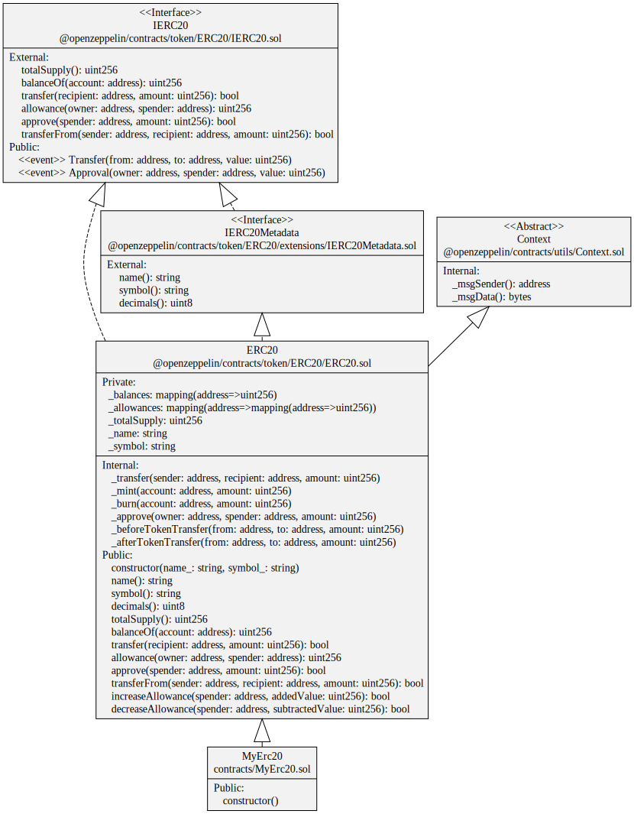
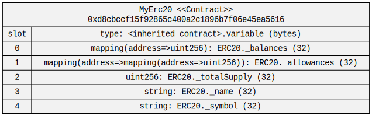

# sol2uml
sol2uml 是一个 Solidity 合约可视化工具。

## 主要功能
- Solidity 合约的统一建模语言（UML）类图生成器
- 合约存储布局图
- 将类 Etherscan 的浏览器上的 Solidity 文件变平(Flatten)后存到本地
- 在类似 Etherscan 的浏览器上对比不同的(已验证)合约

## 使用
`sol2uml [command] <options>`

Commands:
| 命令 | 备注 |
| :------ | :------ |
| class   | 生成 UML 类图 |
| storage   | 可视化展示合约存储槽 |
| flatten   | 把 Solidity 文件变平 |
| diff   | 对比合约，可以是地址(浏览器上已验证的合约)或者本地文件 |

options：
 | 命令 | 备注 |
 | :------ | :------ |
 | -f, --outputFormat <value>                     | 输出文件格式 ("svg"（默认）, "png", "dot", "all")|
 | -o, --outputFileName <value>                   | 输出文件名｜
 | -i, --ignoreFilesOrFolders <filesOrFolders>    | comma-separated list of files or folders to ignore｜
 | -n, --network <network>                        | 区块链网络 （"mainnet"(默认), "goerli", "sepolia", "polygon", "arbitrum", "bsc", "optimism", "gnosis", "base"等）
 | -k, --apiKey <key>                             | 区块链浏览器的KEY |
 | -bc, --backColor <color>                       | Canvas 背景颜色 (默认白色；"none" 则是透明)|
 | -v, --verbose                                  | 使用调试语句运行 (默认: false)|

### 生成 UML 类图  
命令：class [options] <fileFolderAddress>  
eg：`npx sol2uml class 0xd8cbccf15f92865c400a2c1896b7f06e45ea5616 -n goerli -o ./files/uml.svg` 

### 合约存储布局图  
命令：storage [options] <fileFolderAddress>  
eg：`npx sol2uml storage 0xd8cbccf15f92865c400a2c1896b7f06e45ea5616 -n goerli -o ./files/storage.svg`

### 合约扁平化  
命令：flatten <contractAddress>   
eg：`npx sol2uml flatten 0xd8cbccf15f92865c400a2c1896b7f06e45ea5616 -n goerli -o ./files/flatten.sol`  
[flatten.sol](./files/flatten.sol)

### 对比合约
命令：diff [options] <addressA> <fileFoldersAddress>  
eg：`npx sol2uml diff 0xab52c564a46d4a9e1114bf4b2b3c57e83a03b044 . -n goerli`

## 参考
- [sol2uml](https://github.com/naddison36/sol2uml)